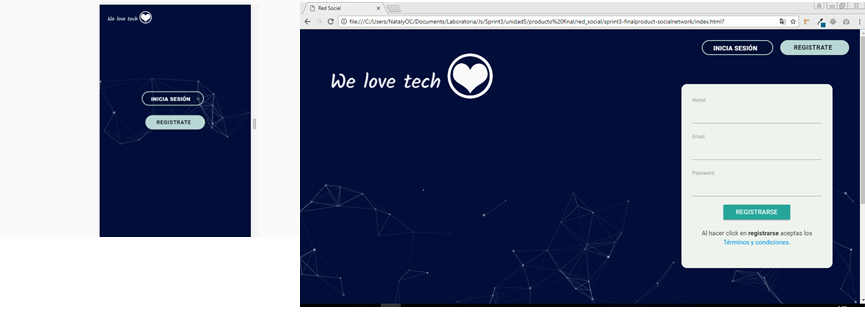

# Producto Final
* **Track:** _Common Core_
* **Curso:** _Crea tu propia red social_
* **Unidad:** _Producto Final Red Social X_

---

#### Enunciados

Crear una red social: Instagram, Snapchat, Twitter, Facebook, Twitch, Linkedin, las redes sociales han invadido nuestra vida. Las amamos, odiamos, idolatramos y muchos no podemos vivir sin ellas. Dado este contexto, un emprendedor muy visionario nos ha encargado crear una red social. No nos da mucho detalle sobre qué tipo de red social quiere, él solo nos dice que creemos la que mejor podamos y que luego lo convenzamos de que nuestra red social será la más exitosa.

Para él hay algunos puntos básicos que debe tener una red social:

* Perfiles de usuarios
* Un newsfeed donde puedes ver las actualizaciones de todos tus contactos
* Un lugar donde poder escribir posts
* Un lugar para subir fotos
* Capacidad para poder tener amigos o para poder seguir a personas/marcas dentro de la red social
* Ser mobile friendly
* Etc.

Este emprendedor, además, sabe que los creadores de productos tienen que pensar siempre en los usuarios y espera que tengas en cuenta lo que necesitan los usuarios al momento de crear este producto, si piensas por ejemplo en una red social para compartir memes, o una para compartir cosas de mascotas o alguna otra para compartir tips sobre restaurantes o recetas, tendrás que tener en cuenta qué es lo que le gustaría encontrar a un usuario sobre estos temas en la red social.

Un ejemplo: a este emprendedor le presentaron un caso de una red social para químicos. En esta red social los químicos postean artículos sobre sus investigaciones y pueden encontrar el contenido de acuerdo a lo más popular, lo reciente o lo más comentado. Además, pueden comentar en los artículos de sus colegas y pueden filtrar artículos de acuerdo a determinadas etiquetas.

Debes subir todos tus ejercicios a GitHub y publicarlos en gh-pages.

## **Red Social: We Love Tech**

Red Social enfocada a personas que gustan de ciencia y tecnología.
### Integrantes:
* Darcy Cervera Huamani.
* Nataly del Carmen Otero Celis.

##### Planificación:
* Dia 1 05/01/18
Creación de ideas
Realización de preguntas

* Dia 2 06/01/18
Encuentas a usuarios
Buscando solución a problematica
Prototipado

* Dia 3 07/01/18
Feeback Prototipado
Uso de Colores y tipografía

* Dia 4-6
Empezando-Desarrollo maquetación y Funcionalidad
Investigacion sobre le uso Firebase.
Creación de Logo.

##### Herramientas utilizadas:
* Framework Materialize
* Diseño Web Responsive
* CSS3
* HTML5

### Sugerencias:

* La presentacion se debe enfocar mas en el producto (app) que quieres vender, y el titulo debe ser el nombre de su aplicacion, que masomenos seria asi:

# We love tech

* Como presentacion hubiese sido ideal poner el logo de su aplicacion al inicio.

* Añadir un eslogan seria genial chicas les da un pluss++.
*eslogan:donde tus ideas tech hacen sinapsis*

* En la primera parte de la introduccion, debio haber sido mas reducido con respecto a lo que piden para su app.
