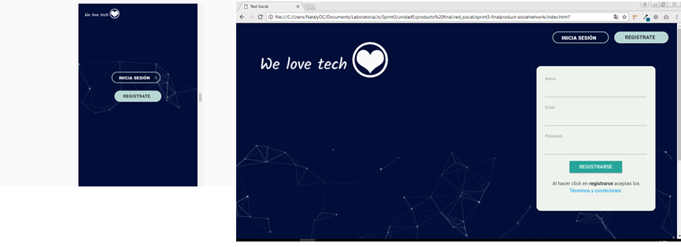

# Producto Final: We Love Tech <3

<i>Donde tus ideas tech hacen sinapsis</i>

Red Social enfocada a personas que gustan de ciencia y tecnología.

### Buscando solución a la problemática:

En la entrevista con nuestro usuario, nos comentó que sus páginas/redes sociales que mas frecuentaba eran: facebook y linkedin, pero, de ambas redes sociales, tenia mayor preferencia las publicaciones acerca de ciencia y tecnología.

### Prototipado:

### Planificación:

**Dia 1 05/01/18**

Creación de ideas
Realización de preguntas

**Dia 2 06/01/18**

Encuentas a usuarios
Buscando solución a problematica
Prototipado

**Dia 3 07/01/18**

Feeback Prototipado
Uso de Colores y tipografía

**Dia 4-6**

Empezando-Desarrollo maquetación y Funcionalidad
Investigacion sobre le uso Firebase.
Creación de Logo.

### Integrantes

* Darcy Cervera Huamani.
* Nataly del Carmen Otero Celis.

#### Herramientas utilizadas:

* Framework Materialize
* Diseño Web Responsive
* CSS3
* HTML5
